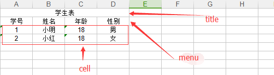

# 简介
这是用来操作excel的一个工具包，可以帮你快速生成格式简单（复杂的你还是用自己用原生poi吧）的excel文档，支持xls,xlsx两种格式。基本的功能大都基于注解。

# example

## 示例的model
> 后面所有的例子都会基于这个对象

```
@StartRow(2)
@Style(titleStyle = YelloStyle.class ,menuStyle = YelloStyle.class)
public class Student {
    @Column(value=1,menu = "姓名")
    private String name ;
    @Column(value=2,menu = "年龄")
    private int age ;
    @Column(value=0,menu = "id")
    private String id ;
    @Column(value=3,menu ="出生日期")
    private Date birth ;
    @Column(value = 4,menu = "性别",converter = GenderConverter.class)
    private String gender ;
    // getter setter 省略了，你懂的
}
```

## 读取
读取必要的两个注解，`@StartRow(rowNum)` 和`@Column(value=columnNum)`
+ rowNum代表，要读取的excel中数据行从第几行开始，rownum最小位0
+ columnNum 代表，该属性对应excel当中的第几列数据

```
List<Student> read = BITME.read(new File("xxx.xls"), Student.class);
```

## 生成文件
先说明一下title,menu,cell这里指的是什么。

生成文件必要的注解 `@Column(columnNum)`
+ 可以通过@Column(menu="menuName") 来生成菜单
+ title(titleName) 可以指定标题
+ list(dataList) 指定用来生成cell的数据

```
BITME.builder(new File("xxx.xlsx")).title(titleName).list(dataList).build(Student.class).write();
```

## HttpServletResponse
想要直接将生成的excel提供下载,以springmvc为例
```
    @RequestMapping("/hello")
    @ResponseBody
    public void index(HttpServletResponse response){
        try {
            BITME.builder(new File("student.xls")).list(dataList).title("学生表").build(Student.class).response(response);
        } catch (IOException e) {
            e.printStackTrace();
        }
    }
```

## 自定义style
@Style注解可以用来自定义标题，菜单，单元格的样式
+ 创建一个ExcelStyle接口的实例
+ 通过`@Style(titleStyle = YelloStyle.class ,menuStyle = YelloStyle.class,cellStyle = YelloStyle.class)`来使用自定义样式

```
public class YelloStyle implements ExcelStyle {
    @Override
    public CellStyle setStyle(CellStyle cellStyle) {
        cellStyle.setFillBackgroundColor(IndexedColors.YELLOW.getIndex());
        cellStyle.setFillPattern(FillPatternType.BIG_SPOTS);
        return cellStyle;
    }
}
```

## 自定义converter
如果有需要转码的需求，比如__student.sex=1__,但希望excel当中显示为__男__而不是1,则可以使用converter实现,读取时也可以将汉字转回为编码
+ 创建一个Converter的实现类
+ 使用 `@Column(converter=GenderConverter.class)` 来指定
```
public class GenderConverter implements Converter<String> {
    @Override
    public String convert(String value) {
        if("0".equals(value)){
            return "女";
        }else{
            return "男";
        }
    }
    @Override
    public String from(Cell cell, Field field) {
        String val = cell.getStringCellValue();
        if(StringUtils.isNotBlank(val)){
            if(val.equals("男")){
                return "1";
            }else{
                return "0";
            }
        }
        return "";
    }
}
```

## emmmmm,暂时就这样了。

